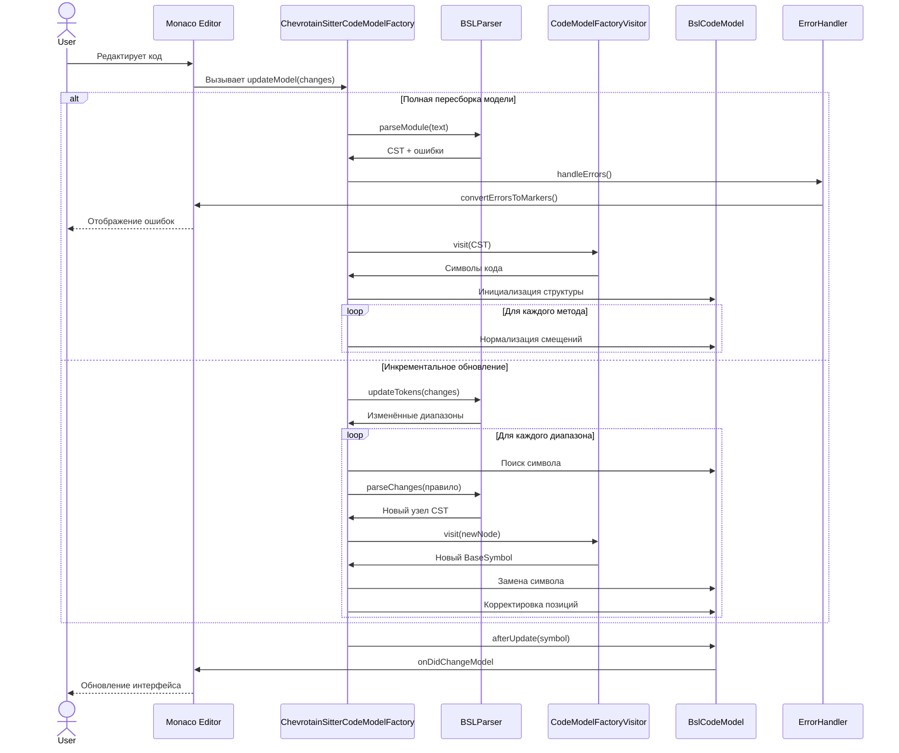
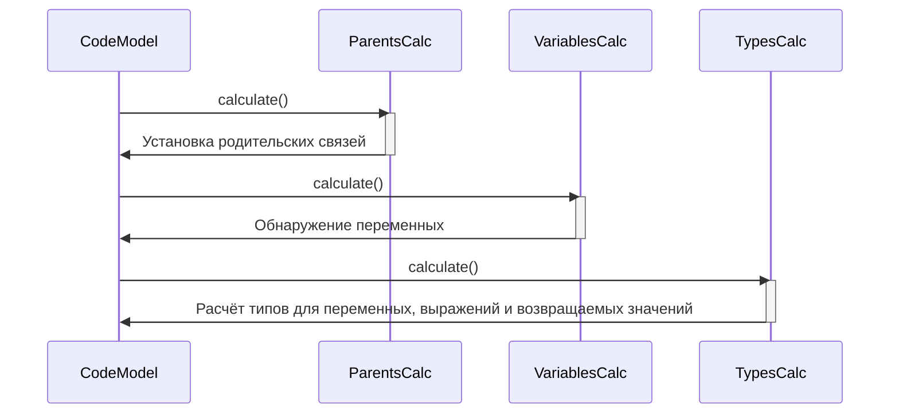

# Семантическая модель модуля

Модель хранит информацию о структуре кода модуля в виде дерева символов (`BaseSymbol`).

**Символ** представляет отдельный элемент, объявленный в исходном коде, платформе или конфигурации. В качестве символов могут выступать: типы, методы, свойства, поля, выражения, параметры, локальные переменные и другие элементы.

Модель позволяет:

* обнаруживать символы, на которые ссылается код в определённом месте;
* вычислять результирующий тип выражения на основе [контекстов](scopes.md);
* реализовывать диагностики;

## Формирование и обновление модели

### Схема обновления модели

### Схема пересчёта после обновления

### Ключевые моменты

1. **Сценарии обновления модели**:
   * Полная пересборка при значительных изменениях.
   * Инкрементальное обновление для мелких правок.

2. **Основные компоненты**:
   * `BSLParser` — парсер языка.
   * `CodeModelFactoryVisitor` — преобразует CST в семантическую модель.
   * `BslCodeModel` — хранилище структуры кода.
   * Механизм обработки ошибок и формирования маркеров Monaco Editor.

3. **Особенности инкрементального обновления**:
   * Локализация изменённых символов.
   * Перепарсинг только затронутых областей.
   * Автоматическая корректировка позиций зависимых символов.
   * Сохранение целостности родительско-дочерних связей.

4. **Этапы постобработки**:
   * Пересчёт родительских связей.
   * Поиск переменных.
   * Определение типов для:
     * переменных и полей,
     * выражений,
     * возвращаемых значений методов.

---

**Оптимизации**

* Минимизация перестроения дерева при инкрементальных изменениях.
* Кэширование результатов расчёта типов.
*  Фоновая обработка ресурсоёмких операций. `В плане`
