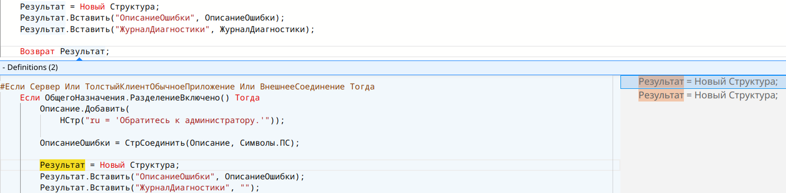

# Возможности

## В первую очередь редактор

Это в первую очередь редактор кода поэтому доступны следующие возможности:

* Раскраска кода
* Контекстная подсказа
  * Подсказка платформы
    * Глобальные методы, переменные и перечисления
    * Конструкторы и типы данных
    * Методы и свойства объектов платформы
  * Подсказка по публичному программному интерфейсу `YAxUnit`
  * Подсказка по локальным переменным
    
  * Подсказка по методам модуля
    
  * Переход к определению
    

* Также реализовано
  * Генерация AST с использованием [`chevrotain`](https://chevrotain.io/)
  * Поиск методов, локальных переменных, выражений
  * Вычисление типов переменных на основании выражений

Планируется

* Подсказка по объектам конфигурации
* Сниппеты (шаблоны)
* Подсказка по ключевым словам с учетом контекста
* Подсказка по итерируемым объектам
* Подсказка по реквизитам структур, таблиц и тд

## Работа с тестами

* Поиск тестов на основании данных регистрации (метод `ИсполняемыеСценарии`)
  
* Запуск тестов
  
  Реализован запуск тестов и отображение ошибок используя механизмы `Monaco`
* Переход к ошибка в тестовом модуле
  

Планируется

* Подсказки по добавлению обработчиков событий
* Подсказки в строках (объекты метаданных, реквизиты и тд)