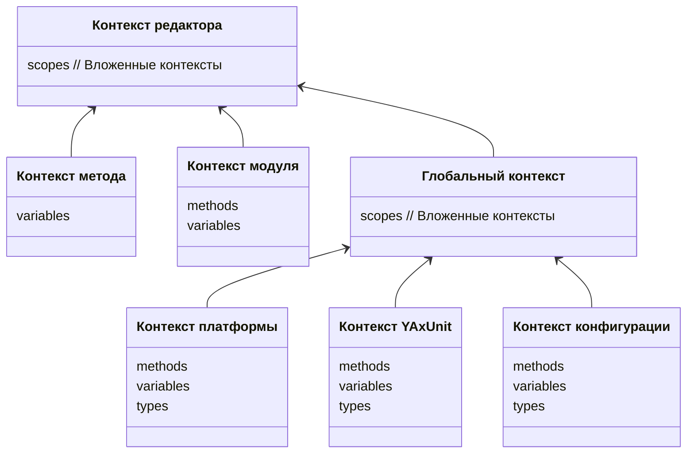

# Контексты (scope)

Механизм [IntelliSense](https://ru.wikipedia.org/wiki/IntelliSense) строится на основании контекстов, которые хранят и возвращают информацию об окружении: переменные, типы, методы и перечисления.

* [Контекст редактора](/src/bsl/scope/editorScope.ts)
* [Контекст модуля](/src/bsl/scope/localModuleScope.ts)
* [Контекст метода](/src/bsl/scope/methodScope.ts)

* [Глобальный контекст](/src/scope/globalScopeManager.ts)
* [Контекст платформы](/src/bsl/scope/platform)
* [Контекст конфигурации](/src/bsl/scope/configuration)
* [Контекст YAxUnit](/src/yaxunit/scope.ts)
